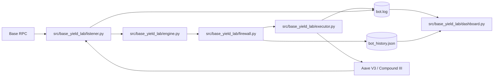

# Base Yield Lab

Open-source study project for learning DeFi automation on the Base network.

Base Yield Lab reads live on-chain data, compares USDC supply opportunities between Aave V3 and Compound III, applies deterministic safety checks, and can prepare or execute transactions depending on the configured mode.

It was built as a learning project. Anyone can fork it, run it, inspect it, and adapt it.

## What It Does

- Connects to Base mainnet through an RPC provider.
- Reads USDC balances from a configured wallet.
- Reads current supply rates from Aave V3 and Compound III.
- Estimates gas cost for a potential move.
- Tracks recent activity in a local JSON file.
- Applies a deterministic safety layer before any transaction.
- Supports paper trading mode for testing without broadcasting transactions.
- Includes a Streamlit dashboard for logs and basic runtime visibility.

## What It Is Not

- Not financial advice.
- Not a production trading system.
- Not audited.
- Not guaranteed to be profitable.
- Not safe to run with meaningful funds without reviewing the code and risks.

Use a dedicated wallet and start with paper trading.

## Architecture



## Project Structure

| Path | Purpose |
| --- | --- |
| `src/base_yield_lab/main.py` | Main loop. Orchestrates reading state, choosing an action, validating it, and executing it. |
| `src/base_yield_lab/listener.py` | Reads Base, Aave V3, Compound III, wallet balances, gas price, and derived state. |
| `src/base_yield_lab/engine.py` | Decision layer that receives the current state and returns an action. |
| `src/base_yield_lab/firewall.py` | Deterministic guardrail layer that validates every move before execution. |
| `src/base_yield_lab/executor.py` | Builds, signs, and optionally broadcasts transactions. |
| `src/base_yield_lab/state.py` | Dataclasses and local persistence for recent activity. |
| `src/base_yield_lab/config.py` | Environment variables, protocol addresses, ABIs, and thresholds. |
| `src/base_yield_lab/dashboard.py` | Streamlit dashboard for logs, APY history, and runtime state. |
| `docs/` | Study notes, original design notes, and planning material. |

## Safety Model

The project uses a simple but important rule: no transaction should be sent before passing deterministic checks.

The firewall validates:

- approved source and destination protocols;
- approved token;
- max transaction size;
- gas cost limit;
- gas price limit;
- cooldown between moves;
- estimated profitability after gas;
- sufficient source balance;
- known destination contract.

Paper trading should remain enabled until the operator understands every transaction the bot can build.

## Requirements

- Python 3.12+
- Base RPC URL
- Dedicated EVM wallet
- Anthropic API key for the decision engine
- USDC and ETH on Base if running live transactions

## Setup

```bash
python -m venv venv
source venv/bin/activate
pip install -r requirements.txt
cp .env.example .env
```

Edit `.env` before running.

```bash
PRIVATE_KEY=
PUBLIC_ADDRESS=
BASE_RPC_URL=
ANTHROPIC_API_KEY=
PAPER_TRADING=true
BOT_LOG_FILE=bot.log
```

Keep `PAPER_TRADING=true` while studying or testing. Setting it to `false` allows the executor to broadcast real transactions.

Even in paper trading, the bot still needs a valid wallet, RPC URL, and API key because it reads live Base data and builds transactions locally before deciding whether to broadcast them.

## Run The Bot

```bash
python src/base_yield_lab/main.py
```

Show available options:

```bash
python src/base_yield_lab/main.py --help
```

Run a single cycle and exit:

```bash
python src/base_yield_lab/main.py --once
```

The bot writes runtime logs to:

- `bot.log`
- `bot_history.json`

Both files are ignored by git.

## Run The Dashboard

```bash
streamlit run src/base_yield_lab/dashboard.py
```

The dashboard reads local logs and history files. It does not need a separate database.

## Configuration

Most tunable values live in `src/base_yield_lab/config.py`:

- `MIN_APY_DIFF`
- `MIN_APY_ABSOLUTE`
- `MAX_GAS_COST_USD`
- `MAX_SINGLE_TX_USDC`
- `MAX_GAS_PRICE_GWEI`
- `POLL_INTERVAL_SECONDS`
- `MIN_TIME_BETWEEN_MOVES`

Protocol addresses and partial ABIs are also centralized there.

## Development Notes

This repository is intentionally small and educational. The code favors explicit modules and comments over framework abstractions.

Good next steps:

- add tests for the firewall;
- add testnet support;
- move protocol configs out of `src/base_yield_lab/config.py`;
- add a strategy interface;
- improve dashboard state parsing;
- add CI for linting and tests.

## Security Notes

- Never commit `.env`.
- Never reuse a wallet that holds meaningful funds.
- Review every contract address before live mode.
- Review every transaction path before live mode.
- Use paper trading first.
- Assume bugs can lose funds.

## License

MIT. See [LICENSE](LICENSE).
